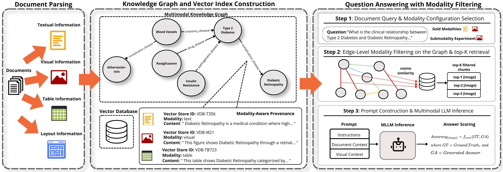

<div align="center">

# Signal or Noise? Evaluating Modality Contributions in Multimodal Knowledge Graph Question Answering



</div>

---

## Datasets

To reproduce the experiments, you need to download the following two datasets:

| Dataset | Source | Documents size |
|---------|--------|----------------|
| **LongDocURL** | [HuggingFace](https://huggingface.co/datasets/dengchao/LongDocURL) | ~3 GB |
| **MMLongBench-Doc** | [GitHub](https://github.com/mayubo2333/MMLongBench-Doc) | ~670 MB |

Each dataset should be placed inside its corresponding folder as shown below.

<details>
<summary><b>LongDocURL</b></summary>

```
longdocurl/
├── LongDocURL.jsonl   # the file with all the questions (included in repo)
└── pdfs/              # PDF documents
    ├── 4000/
    │   ├── 4000045.pdf
    │   └── 4000400.pdf
    ├── 4001/
    │   └── 4001506.pdf
    └── ...
```

</details>

<details>
<summary><b>MMLongBench-Doc</b></summary>

```
mmlongbench/
└── data/
    ├── MMLongBench.json   # the file with all the questions (included in repo)
    └── documents/         # PDF documents (flat, no subfolders)
        ├── 2307.09288v2.pdf
        ├── 3M_2018_10K.pdf
        ├── AMAZON_2017_10K.pdf
        └── ...
```

</details>

---

## Installation

```bash
# 1. Create venv
python -m venv .venv
source .venv/bin/activate

# 2. Install the project with all extras (resolves lightrag, mineru, torch, etc.)
pip install -e ".[all]"
```

---

## Local Models (Ollama)

The experiments use locally-served models via [Ollama](https://ollama.com/). Make sure Ollama is installed on your system, then pull the required models:

```bash
ollama pull gemma3:4b
ollama pull gemma3:27b
ollama pull qwen3-vl:8b
ollama pull qwen3-vl:30b
```

> The Ollama server must be running at `http://localhost:11434` when you launch the pipeline.

If you don't want to run experiments with all models, edit the `config.py` file in each benchmark folder and comment out the models you wish to skip.

---

## Data Preprocessing

We filter each dataset to keep only questions whose evidence spans **exactly 2 modalities** — the subset used in our experiments.

After placing the dataset files in their corresponding folders, run:

```bash
python longdocurl/create_2modalities_dataset.py
python mmlongbench/create_2modalities_dataset.py
```

This will produce two new files:

| Dataset | Output file |
|---------|-------------|
| LongDocURL | `LongDocURL_public_cleaned_2modalities.jsonl` |
| MMLongBench | `samples_2modalities.json` |

---

## Running the Pipeline

Before running the experiments, add your OpenAI API key to the `.env` file:

```bash
OPENAI_API_KEY=sk-...
```

The modality contribution analysis pipeline is run separately for each benchmark:

```bash
python longdocurl/modality_contribution_analysis/main.py
python mmlongbench/modality_contribution_analysis/main.py
```

Each script accepts several parameters to configure the run (e.g. device, document range, result directory). Use `--help` to see all options:

```bash
python longdocurl/modality_contribution_analysis/main.py --help
```


## Checkpointing

Results are saved after **every question**, so the pipeline can be interrupted and resumed safely. On restart it automatically skips questions that already have results.

## Pipeline Details

The pipeline processes each PDF document end-to-end and evaluates how different modality combinations contribute to answering questions.

### What happens when you run the pipeline

For each document:
1. **Parse** – The PDF is parsed with MinerU into structured content (text blocks, images, tables). This produces a `content_list.json` with page-by-page elements.
2. **Build Knowledge Graph** – All content (text, images, tables) is inserted into a LightRAG knowledge graph via RAGAnything. The LLM extracts entities and relationships from each chunk.
3. **Answer questions** – For each question and each non-empty subset of its gold modalities (e.g. for gold `[text, image]` → subsets `[text]`, `[image]`, `[text, image]`):
   - Retrieve relevant KG triples/chunks filtered to only the current modality subset.
   - Build a prompt with the retrieved context (including actual images for vision models).
   - Send the prompt to the evaluation model and extract the predicted answer.
   - Score the prediction against the ground truth (based on the benchmark's evaluation).

<details>
<summary><strong>Modality-Aware Provenance Framework</strong> (click to expand)</summary>

A key component of the pipeline is the **modality-aware provenance framework** (`evidence.py`). It solves a core problem: after the LLM extracts entities and relationships from a document, we need to know *which modality* each KG triple came from so we can later retrieve by modality subset.

**How it works:**

1. During KG construction, each text chunk is processed by the LLM to extract `(source, relation, target)` triples. Each chunk has a known modality (text, image, table, etc.) based on the MinerU parsing output.
2. After triples are inserted, the evidence tracker links each KG edge back to its source chunk(s) and records metadata:
   - `chunk_id` – which chunk produced the triple
   - `modality` – the modality of that chunk (text, image, table, header, etc.)
   - `doc_id` – the source document
3. This provenance is stored as an `evidence_summary_json` attribute on each graph edge, containing a list of sources with their modalities.

**Why it matters for the evaluation:**

During retrieval, we filter graph edges by modality. For example, when evaluating the `[image]` subset, we only retrieve edges whose evidence sources include `image`. This is how we isolate the contribution of each modality — by controlling what information is available to the model at query time.

```
Edge: ("Apple M2 chip", "has feature", "Neural Engine")
  └── evidence_summary_json:
        sources: [
          { chunk_id: "abc123", modality: "text", doc_id: "doc1" },
          { chunk_id: "def456", modality: "image", doc_id: "doc1" }
        ]
        modality: "image,text"
```

In this example, the edge would be retrieved for subsets `[text]`, `[image]`, or `[text, image]` — but not for `[table]`.

</details>

### What is saved locally (example for running the LongDocURL)

```
processed_documents_longdocurl/         # --processed-docs-dir
└── {doc_name}/
    ├── output/                         # MinerU parsing output
    │   ├── content_list.json           # Structured page content (text, images, tables)
    │   ├── images/                     # Extracted images from the PDF
    │   └── ...
    └── rag_storage/                    # LightRAG knowledge graph data
        ├── graph_chunk_entity_relation.graphml
        ├── kv_store_*.json             # Key-value stores (entities, relations, chunks)
        ├── vdb_*                       # Vector DB index files (FAISS)
        └── evidence_map.json           # Modality-to-triple mapping

results_longdocurl/                     # --results-dir
├── gemma3_4b_results_vlm.json          # Full results per model
└── gemma3_4b_logprobs.json             # Logprobs per model (when available)
```

- **`processed_documents_*/`** – Cached per-document data. If a document has already been parsed and its KG built, the pipeline reuses this on subsequent runs (no re-processing needed).
- **`results_*/`** – Final evaluation results (see below).


### Results file structure

Each `{model}_results_vlm.json` is a JSON array where every entry represents **one question answered with one modality subset**. For example, a question with gold modalities `[text, image]` produces 3 entries: one for `[text]`, one for `[image]`, and one for `[text, image]`.

---

## Evaluation


### Accuracy

To compute accuracy per model and modality combination, make sure the result files are present in the folders `results_longdocurl/` and `results_mmlongbench/`, then run:

```bash
python evaluation/accuracy_per_model.py
```

This prints a table of accuracy (%) broken down by benchmark, model, and modality combination.


### SHAPE Metric

For the full SHAPE metric analysis per benchmark and model (marginal contributions, and cooperation scores), run:

```bash
python evaluation/shape_metric.py
```

The output file `shape_metric_output/shape_metric_results.txt` contains the detailed scores.

To generate the contribution (S) and cooperation (C12) bar charts for each benchmark and aggregated across both, run:

```bash
python evaluation/plot_modality_contribution_per_model.py
```

Figures are saved to `evaluation/shape_metric_output/figures/`.


## Statistical Analysis

For our main bootstrap sampling analysis stratified by both benchmark and modality pair (100,000 samples by default), run:

```bash
python statistical_analysis/stratified_by_benchmark/stratified_by_benchmark_bootstrap.py
```

You can change the number of bootstrap samples from inside the script.


For the bootstrap Spearman rank correlation analysis (testing whether models agree on the ranking of modality pairs by contribution), run:

```bash
python statistical_analysis/stratified_by_benchmark/bootstrap_spearman_correlation.py
```
Results are saved to `statistical_analysis/stratified_by_benchmark/spearman_output/`.

## Forest Plots

To generate the forest plots from the bootstrap results, run:

```bash
python statistical_analysis/stratified_by_benchmark/plot_stratified_by_benchmark.py
```

This produces six figures:

- **`stratified_by_benchmark_forest_D_permodel.png`** — Forest plot of D (dominance difference) per modality pair, with per-model bootstrap means, 95% CIs, and cross-model mean (diamond).
- **`stratified_by_benchmark_forest_C12_permodel.png`** — Same as above for C12 (cooperation score).
- **`per_benchmark_forest_D_permodel.png`** — D forest plot split by benchmark (LongDocURL vs MMLongBench).
- **`per_benchmark_forest_C12_permodel.png`** — C12 forest plot split by benchmark.
- **`pooled_compact.png`** — Compact side-by-side view of D and C12 across all modality pairs (pooled).
- **`per_benchmark_compact.png`** — Same compact layout, split by benchmark.


## Alternative Stratification Scenarios

The following are robustness checks that test the sensitivity of the results under different sampling assumptions. Both use 100,000 bootstrap replicates by default.

**Stratified by modality pair only** — resamples within each modality pair but does not preserve benchmark proportions:

```bash
python statistical_analysis/stratified/stratified_bootstrap.py
python statistical_analysis/stratified/plot_stratified.py
```

**Unstratified (global pool)** — draws from a single global pool where modality-pair proportions are free to fluctuate across replicates:

```bash
python statistical_analysis/unstratified/unstratified_bootstrap.py
python statistical_analysis/unstratified/plot_unstratified.py
```

**Cross-scenario comparison** — visual comparison across all three stratification scenarios (requires all three to have been run):

```bash
python statistical_analysis/comparison/compare_scenarios.py
python statistical_analysis/comparison/plot_scenario_forest.py
```

For each scenario, always run the bootstrap script before the corresponding plot script.


## Question Intent Analysis

We adopt a question-intent taxonomy and perform zero-shot classification: each question is sent to GPT-5 with the taxonomy prompt, and the model assigns a single intent category based on the question's wording and communicative goal (not the domain or topic).

To run the classification:

```bash
python question_intent_analysis/question_intent_classification/classify_intent.py
```

This requires the `OPENAI_API_KEY` in your `.env` file. Output files are saved to `question_intent_analysis/`.
